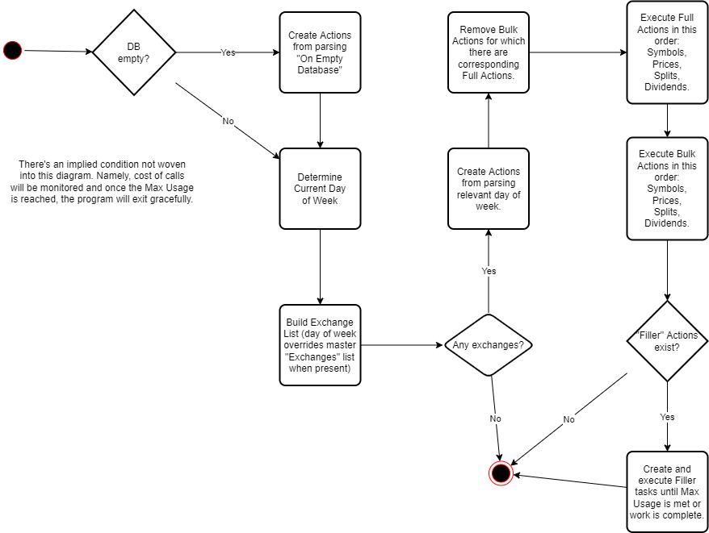

# Development Journal

## 2022-11-13

### Configuration

Here's my take on how the process should flow.

1. Collect some "actions" to be taken. "Full" overrides "Bulk" ("Bulk" actions disappear) when actions are matched on exchange and subtype (e.g., "Symbols", "Splits", etc.).
    1. Existing actions that are not complete are the first ones in the bucket.
    1. Check the specific day of the week; unless "Actions" is "Do Nothing", then take the actions from "Any Day" and put them in the bucket.
    1. Remove all Bulk actions that have corresponding Full actions (i.e., exchange and subtype match).
1. Execute those actions in the following type order:
    1. Full
    1. Bulk
    1. Filler
1. Execute those type actions in the order presented in the configuration file.
1. Monitor cost and max usage (**Max Token Usage** in YAML config file). If max is touched, exit the program.

#### Notes

1. When it comes to any action, completing the action may take multiple days because of the token usage limit.
    1. Maybe need a "run logger" that keeps tracks of the Actions and their state:
        1. Not Started
        1. In Progress
        1. Error
        1. Usage Requirement Met
        1. Completed
    1. Would also need a bit more information, like "last symbol processed" . . . ?? Might need more intelligence in the process itself.
1. When it comes to fundamentals, they only need to be checked every 3 months (double-check that assumption).
    1. Need a way to set a date for these so that we aren't capturing the same data over and over for no good reason.